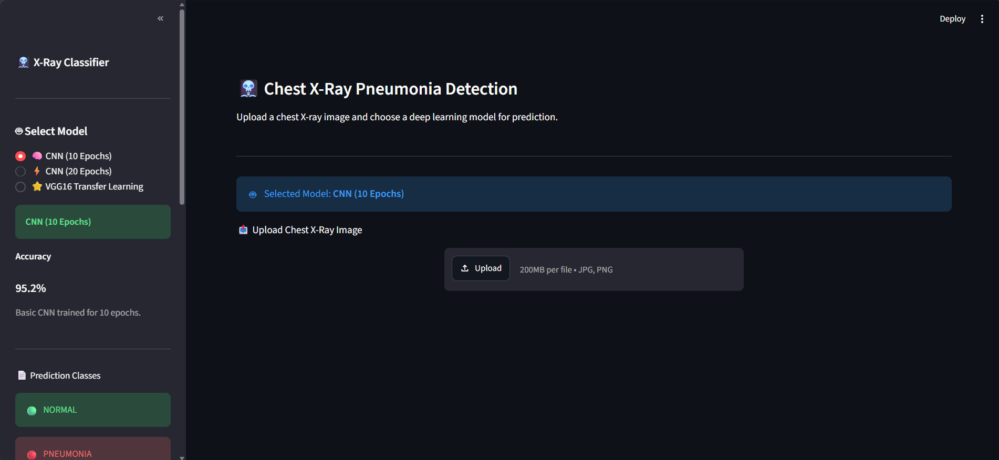

<div align="center">

# 🩻 AI Chest X-Ray Pneumonia Detection

### *Deep Learning Powered Pneumonia Detection using Flask REST API & Streamlit*



[]()
[]()
[]()
[]()
[]()
[]()
[]()
[]()

## 🩺 AI-Powered Chest X-Ray Pneumonia Detection

### Full Stack Deep Learning Application using **Flask**, **Streamlit**, **TensorFlow**, **Render** and **Hugging Face**

</div>

---

# 🌟 Overview

AI Chest X-Ray Pneumonia Detection is a **Full Stack Deep Learning** application designed to classify chest X-ray images into:

- 🟢 NORMAL
- 🔴 PNEUMONIA

The application combines a modern **Streamlit frontend** with a **Flask REST API backend** to perform real-time inference using multiple Deep Learning models.

Unlike traditional Streamlit-only projects, this application follows a production-inspired architecture where the frontend and backend are completely separated.

The trained Deep Learning models are stored on **Hugging Face Hub** instead of GitHub, allowing a lightweight repository while automatically downloading and caching models during deployment.

To overcome memory limitations on free cloud hosting, the application uses **two independent Flask backend services** deployed on **Render**:

- Backend 1 → CNN Models
- Backend 2 → VGG16 Transfer Learning

The Streamlit frontend automatically routes prediction requests to the appropriate backend based on the selected model.

---

# 🚀 Live Demo

### 🌐 Streamlit Frontend

https://pnuemonia-detection-cnn-vgg.streamlit.app/

---

### ⚙ Flask Backend (CNN)

https://xray-pnuemonia-flask-streamlit-1.onrender.com

---

### ⚙ Flask Backend (VGG16)

https://xray-pnuemonia-flask-streamlit-2.onrender.com

---

# 🔗 Quick Links

| Resource | Link |
|----------|------|
| 🌐 Live Application | https://pnuemonia-detection-cnn-vgg.streamlit.app/ |
| ⚙ CNN Backend API | https://xray-pnuemonia-flask-streamlit-1.onrender.com |
| ⚙ VGG16 Backend API | https://xray-pnuemonia-flask-streamlit-2.onrender.com |
| 💻 GitHub Repository | https://github.com/M-Sudheer18/XRay-Pnuemonia-Flask-streamlit |

---

# ✨ Key Features

## 🩻 Image Classification

- Upload Chest X-Ray Images
- Detect Pneumonia
- Binary Classification

---

## 🤖 Multiple Deep Learning Models

✔ CNN (10 Epochs)

✔ CNN (20 Epochs)

✔ VGG16 Transfer Learning

---

## ⚙ Backend Features

- Flask REST API
- Automatic Image Validation
- Model Selection API
- JSON Response
- Exception Handling
- Automatic Image Cleanup

---

## 🎨 Frontend Features

- Interactive Streamlit Interface
- Sidebar Model Selection
- Prediction Confidence
- Probability Distribution
- Responsive Layout
- Modern User Interface

---

## ☁ Cloud Features

- Hugging Face Model Hosting
- Automatic Model Download
- Cached Models
- Render Deployment
- Streamlit Community Cloud Deployment

---

## 📊 Prediction Results

The application displays:

- Prediction Class
- Confidence Score
- Class Probabilities
- Selected Deep Learning Model
- Real-Time Prediction

---

# 🏗 System Architecture

The application follows a **Full Stack Client-Server Architecture** where the frontend, backend, and Deep Learning models are completely separated.

```text
                         👨 User
                            │
                            ▼
               🌐 Streamlit Frontend
                            │
                Upload Chest X-Ray Image
                            │
                            ▼
                Select Deep Learning Model
                            │
        ┌───────────────────┴───────────────────┐
        │                                       │
        ▼                                       ▼
 CNN Models Selected                     VGG16 Selected
        │                                       │
        ▼                                       ▼
 Flask Backend (CNN)                   Flask Backend (VGG16)
      Render #1                           Render #2
        │                                       │
        └───────────────┬───────────────────────┘
                        │
                        ▼
              Hugging Face Model Hub
                        │
               Download & Cache Models
                        │
                        ▼
             TensorFlow / Keras Prediction
                        │
                        ▼
        JSON Response (Prediction Result)
                        │
                        ▼
              Streamlit Displays Result
```

---

# ⚙ Application Workflow

```text
             🩻 Upload Chest X-Ray Image
                          │
                          ▼
               Streamlit Frontend UI
                          │
                          ▼
              User Selects AI Model
                          │
          ┌───────────────┴───────────────┐
          │                               │
          ▼                               ▼
    CNN10 / CNN20                    VGG16 Transfer Learning
          │                               │
          ▼                               ▼
 Flask Backend (Render)          Flask Backend (Render)
          │                               │
          └───────────────┬───────────────┘
                          ▼
           Automatic Image Preprocessing
                          ▼
              TensorFlow Model Inference
                          ▼
          Confidence + Class Probability
                          ▼
               Final Prediction Display
```

---

# 📂 Project Structure

```text
XRay-Pnuemonia-Flask-streamlit
│
├── backend_cnn/
│   │
│   ├── app.py
│   ├── config.py
│   ├── model_loader.py
│   ├── predictor.py
│   ├── preprocess.py
│   ├── uploads/
│   ├── requirements.txt
│   ├── runtime.txt
│   └── .python-version
│
├── backend_vgg/
│   │
│   ├── app.py
│   ├── config.py
│   ├── model_loader.py
│   ├── predictor.py
│   ├── preprocess.py
│   ├── uploads/
│   ├── requirements.txt
│   ├── runtime.txt
│   └── .python-version
│
├── frontend/
│   │
│   ├── app.py
│   ├── api.py
│   ├── style.css
│   ├── requirements.txt
│   └── assets/
│       ├── banner.png
│       ├── home.png
│       ├── result.png
│       └── architecture.png
│
├── .gitignore
├── LICENSE
└── README.md
```

---

# 🧠 Deep Learning Models

The application supports multiple Deep Learning architectures for comparison and inference.

| Model | Architecture | Input | Activation | Purpose |
|--------|-------------|--------|------------|----------|
| CNN (10 Epochs) | Custom CNN | Grayscale (100×100×1) | Sigmoid | Binary Classification |
| CNN (20 Epochs) | Improved CNN | Grayscale (100×100×1) | Sigmoid | Binary Classification |
| VGG16 | Transfer Learning | RGB (100×100×3) | Sigmoid | Binary Classification |

---

## 🧠 CNN (10 Epochs)

**Architecture**

- Convolution Layers
- MaxPooling Layers
- Dropout Layers
- Fully Connected Dense Layer
- Binary Sigmoid Output

### Input

```text
100 × 100 × 1
```

### Output

```text
NORMAL

or

PNEUMONIA
```

---

## 🧠 CNN (20 Epochs)

Improved CNN architecture trained for more epochs with additional feature extraction capability.

Features:

- Deeper Feature Maps
- Better Accuracy
- Improved Generalization
- Binary Classification

---

## ⭐ VGG16 Transfer Learning

Transfer Learning model based on ImageNet pretrained weights.

Features:

- Pretrained VGG16 Backbone
- Frozen Convolution Layers
- Custom Dense Layers
- Binary Sigmoid Output
- High Accuracy

Input Shape

```text
100 × 100 × 3
```

Output

```text
NORMAL

or

PNEUMONIA
```

---

# ☁ Hugging Face Model Storage

Instead of storing trained models inside GitHub, all trained models are hosted securely on **Hugging Face Hub**.

The backend automatically downloads models during startup using:

```python
from huggingface_hub import hf_hub_download
```

Available models:

- model_xray.h5
- model_pre.h5
- best_model.keras

Advantages

- Smaller GitHub Repository
- Faster Deployment
- Automatic Download
- Local Model Caching
- Easy Model Version Management

# ⚙ Flask Backend Architecture

The backend is built using **Flask REST API** to perform image preprocessing, model loading, inference, and prediction.

Unlike traditional Machine Learning applications where inference happens directly inside the frontend, this project follows a client-server architecture.

The Streamlit application communicates with the Flask backend using HTTP requests.

---

## Backend Services

The application uses **two independent Flask services** deployed on Render.

### 🟢 Backend 1

Supports:

- CNN (10 Epochs)
- CNN (20 Epochs)

Deployment

```text
Render
│
└── backend_cnn
```

Responsibilities

- Validate uploaded images
- Preprocess grayscale images
- Load CNN models
- Perform prediction
- Return JSON response

---

### ⭐ Backend 2

Supports:

- VGG16 Transfer Learning

Deployment

```text
Render
│
└── backend_vgg
```

Responsibilities

- Validate uploaded images
- RGB preprocessing
- VGG16 preprocessing
- TensorFlow prediction
- Return JSON response

---

# 🔄 Backend Request Flow

```text
Client Request
       │
       ▼
Receive Image
       │
       ▼
Validate Extension
       │
       ▼
Save Image
       │
       ▼
Select Model
       │
       ▼
Image Preprocessing
       │
       ▼
TensorFlow Prediction
       │
       ▼
Generate JSON Response
       │
       ▼
Delete Uploaded Image
       │
       ▼
Return Prediction
```

---

# 📡 REST API Endpoints

## Home Endpoint

```http
GET /
```

Response

```json
{
    "message": "Chest X-Ray Pneumonia Detection API",
    "status": "Running",
    "available_models": [
        "cnn10",
        "cnn20"
    ]
}
```

---

## Health Endpoint

```http
GET /health
```

Response

```json
{
    "status": "Healthy"
}
```

---

## Prediction Endpoint

```http
POST /predict
```

Request

```text
Form Data

image : Chest X-Ray
model : cnn10

or

model : cnn20

or

model : vgg16
```

Response

```json
{
    "prediction": "NORMAL",
    "confidence": 99.78,
    "probabilities": {
        "NORMAL": 99.78,
        "PNEUMONIA": 0.22
    },
    "model": "CNN (20 Epochs)"
}
```

---

# 🤖 Model Loading Strategy

The backend uses **Lazy Loading** to reduce memory consumption.

Instead of loading every model during application startup, only the requested model is loaded.

Workflow

```text
Prediction Request
        │
        ▼
Check Requested Model
        │
        ▼
Already Loaded ?
     │         │
    Yes       No
     │         │
     ▼         ▼
Use Model   Download (if needed)
                │
                ▼
          Load TensorFlow Model
                │
                ▼
          Store in Memory
```

Benefits

- Faster startup
- Lower RAM usage
- Reduced Render memory consumption
- Better scalability

---

# ☁ Hugging Face Integration

All trained models are stored in **Hugging Face Hub**.

The backend downloads them automatically.

```python
from huggingface_hub import hf_hub_download
```

Downloaded Models

```text
model_xray.h5
model_pre.h5
best_model.keras
```

The downloaded models are cached locally after the first download.

---

# 🎨 Streamlit Frontend

The frontend is built using **Streamlit**.

Responsibilities

- Upload Chest X-Ray Images
- Select Deep Learning Model
- Send HTTP Requests
- Display Prediction Results
- Display Confidence
- Display Probability Distribution

---

# 🌐 Frontend Workflow

```text
User
 │
 ▼
Upload Image
 │
 ▼
Choose Model
 │
 ▼
Click Predict
 │
 ▼
HTTP POST Request
 │
 ▼
Flask Backend
 │
 ▼
Receive JSON
 │
 ▼
Display Results
```

---

# 🔀 Frontend API Routing

The frontend automatically selects the correct backend.

```text
Selected Model
        │
        ▼
 ┌───────────────┐
 │ cnn10         │
 │ cnn20         │
 └──────┬────────┘
        │
        ▼
CNN Backend (Render)

────────────────────────────

Selected Model
        │
        ▼
┌──────────────┐
│   vgg16      │
└──────┬───────┘
       │
       ▼
VGG Backend (Render)
```

---

# 📊 JSON Response Structure

Every successful prediction returns

```json
{
    "prediction": "PNEUMONIA",
    "confidence": 97.83,
    "probabilities": {
        "NORMAL": 2.17,
        "PNEUMONIA": 97.83
    },
    "model": "VGG16 Transfer Learning"
}
```

This standardized response allows the Streamlit frontend to display predictions consistently across all supported models.

# 🧹 Image Preprocessing

Before making predictions, every uploaded Chest X-Ray image undergoes preprocessing to match the input requirements of the selected Deep Learning model.

The application automatically selects the appropriate preprocessing pipeline based on the user's chosen model.

---

# 🧠 CNN Preprocessing Pipeline

CNN models are trained using **grayscale images**.

### Workflow

```text
Input Chest X-Ray
        │
        ▼
Convert Image to Grayscale
        │
        ▼
Resize Image
(100 × 100)
        │
        ▼
Normalize Pixel Values
(0 → 1)
        │
        ▼
Expand Channel Dimension
        │
        ▼
Expand Batch Dimension
        │
        ▼
Tensor Shape

(1, 100, 100, 1)
```

### Processing Steps

- Convert image to Grayscale
- Resize to **100 × 100**
- Convert into NumPy Array
- Normalize pixel values
- Expand dimensions
- Feed into CNN Model

---

# ⭐ VGG16 Preprocessing Pipeline

Unlike CNN models, VGG16 expects **RGB images** and ImageNet preprocessing.

### Workflow

```text
Input Chest X-Ray
        │
        ▼
Convert Image to RGB
        │
        ▼
Resize Image
(100 × 100)
        │
        ▼
Convert to NumPy Array
        │
        ▼
preprocess_input()
        │
        ▼
Expand Batch Dimension
        │
        ▼
Tensor Shape

(1,100,100,3)
```

### Processing Steps

- Convert image to RGB
- Resize image
- Convert into NumPy Array
- Apply `preprocess_input()`
- Expand dimensions
- Feed into VGG16

---

# 🤖 Prediction Pipeline

Once preprocessing is completed, the backend loads the requested Deep Learning model and performs inference.

```text
Uploaded Image
        │
        ▼
Image Validation
        │
        ▼
Model Selection
        │
        ▼
Image Preprocessing
        │
        ▼
TensorFlow Model Prediction
        │
        ▼
Prediction Score
        │
        ▼
Confidence Calculation
        │
        ▼
Probability Calculation
        │
        ▼
JSON Response
        │
        ▼
Streamlit Frontend
```

---

# 🧠 Model Selection Logic

The frontend automatically determines which backend should process the uploaded image.

```text
Selected Model
        │
        ▼
 ┌────────────────────────────┐
 │ CNN (10 Epochs)            │
 │ CNN (20 Epochs)            │
 └─────────────┬──────────────┘
               │
               ▼
        Flask CNN Backend

──────────────────────────────────

Selected Model
        │
        ▼
┌──────────────────────────────┐
│ VGG16 Transfer Learning       │
└─────────────┬─────────────────┘
              │
              ▼
        Flask VGG Backend
```

---

# ⚡ TensorFlow Inference

Each backend performs inference using TensorFlow/Keras.

The prediction process consists of:

1. Loading the requested model
2. Preprocessing the uploaded image
3. Performing forward propagation
4. Calculating prediction score
5. Returning prediction as JSON

---

# 📊 Binary Classification

The application predicts one of two classes.

| Class | Meaning |
|--------|----------|
| 🟢 NORMAL | Healthy Chest X-Ray |
| 🔴 PNEUMONIA | Pneumonia Detected |

---

# 🎯 Prediction Logic

The backend automatically supports both output layer types.

---

## Binary Sigmoid

Models using

```python
Dense(1, activation="sigmoid")
```

Prediction Logic

```text
Probability ≥ 0.50
        │
        ▼
🔴 PNEUMONIA
```

```text
Probability < 0.50
        │
        ▼
🟢 NORMAL
```

---

## Two-Class Softmax

Models using

```python
Dense(2, activation="softmax")
```

Prediction

```python
prediction = np.argmax(probabilities)
```

The backend automatically detects the model output shape and performs the correct prediction without changing any application code.

---

# 📈 Confidence Calculation

Confidence is calculated using the prediction probability returned by the Deep Learning model.

Example

```text
Prediction

0.9864

↓

Confidence

98.64%
```

---

# 📊 Probability Distribution

The frontend visualizes the probability of both classes.

Example

```text
NORMAL

██████████████░░░░

91.45%

──────────────────────────

PNEUMONIA

██░░░░░░░░░░░░░░░░

8.55%
```

---

# 📤 JSON Response

Example response returned by Flask

```json
{
    "prediction": "NORMAL",
    "confidence": 98.64,
    "probabilities": {
        "NORMAL": 98.64,
        "PNEUMONIA": 1.36
    },
    "model": "CNN (20 Epochs)"
}
```

The Streamlit frontend parses this response and displays:

- Prediction Label
- Confidence Score
- Probability Distribution
- Selected Model
- User-friendly Result

# 🚀 Installation

## 1️⃣ Clone the Repository

```bash
git clone https://github.com/M-Sudheer18/XRay-Pnuemonia-Flask-streamlit.git

cd XRay-Pnuemonia-Flask-streamlit
```

---

# 📦 Install Dependencies

## Backend CNN

```bash
cd backend_cnn

pip install -r requirements.txt
```

---

## Backend VGG16

```bash
cd backend_vgg

pip install -r requirements.txt
```

---

## Frontend

```bash
cd frontend

pip install -r requirements.txt
```

---

# ▶ Running the Application

## Start CNN Backend

```bash
cd backend_cnn

python app.py
```

Runs at

```text
http://127.0.0.1:5000
```

---

## Start VGG16 Backend

```bash
cd backend_vgg

python app.py
```

Runs on another configured port during local development.

---

## Start Streamlit Frontend

```bash
cd frontend

streamlit run app.py
```

---

# ☁ Hugging Face Integration

The trained Deep Learning models are **not stored inside GitHub**.

Instead, all models are hosted securely on **Hugging Face Hub**.

During backend startup:

```text
Backend Starts
       │
       ▼
Connect Hugging Face
       │
       ▼
Download Requested Model
       │
       ▼
Cache Model
       │
       ▼
Load TensorFlow Model
```

Models Hosted

```text
model_xray.h5
model_pre.h5
best_model.keras
```

Advantages

- Smaller Repository
- Faster Deployment
- Automatic Download
- Local Caching
- Version Management

---

# ☁ Deployment

The project is deployed using **two different cloud platforms**.

---

## 🌐 Streamlit Community Cloud

Hosts

- User Interface
- Model Selection
- Image Upload
- Result Visualization

Live Application

```text
https://pnuemonia-detection-cnn-vgg.streamlit.app/
```

---

## ⚙ Render Backend 1

Hosts

- CNN (10 Epochs)
- CNN (20 Epochs)

Live API

```text
https://xray-pnuemonia-flask-streamlit-1.onrender.com
```

---

## ⚙ Render Backend 2

Hosts

- VGG16 Transfer Learning

Live API

```text
https://xray-pnuemonia-flask-streamlit-2.onrender.com
```

---

# ☁ Deployment Architecture

```text
                     GitHub Repository
                             │
        ┌────────────────────┼────────────────────┐
        │                    │                    │
        ▼                    ▼                    ▼
 Streamlit Cloud      Render Backend       Render Backend
     Frontend             CNN                  VGG16
        │                  │                    │
        └──────────────┬───┴────────────────────┘
                       ▼
              Hugging Face Model Hub
                       │
                       ▼
              TensorFlow Prediction
                       │
                       ▼
                  Prediction Result
```

---

# 📸 Application Screenshots

## 🏠 Home Page

```html
<p align="center">

</p>
```

---

## 🤖 Prediction Result

```html
<p align="center">

</p>
```

---

## 🏗 System Architecture

```html
<p align="center">

</p>
```

---

## 🎥 Demo

```html
<p align="center">

</p>
```

---

# 💻 Technology Stack

| Category | Technologies |
|----------|--------------|
| Programming | Python |
| Frontend | Streamlit |
| Backend | Flask REST API |
| Deep Learning | TensorFlow |
| Neural Networks | Keras |
| Image Processing | Pillow |
| Numerical Computing | NumPy |
| Model Hosting | Hugging Face Hub |
| Cloud Backend | Render |
| Cloud Frontend | Streamlit Community Cloud |
| API Communication | Requests |
| Version Control | Git & GitHub |

---

# 📈 Future Improvements

The following enhancements are planned for future versions:

- 🎯 Grad-CAM Visualization
- 🧠 Explainable AI (XAI)
- 📄 PDF Medical Report Generation
- 📊 Prediction History Dashboard
- 📦 Batch Image Prediction
- 📱 Mobile Responsive UI
- 🌐 User Authentication
- ☁ Docker Deployment
- 🔄 Continuous Integration / Continuous Deployment
- ⚡ ONNX Runtime Support
- 🚀 TensorFlow Lite Optimization
- 🧠 EfficientNet Integration
- 🔬 DenseNet Support
- 📊 Model Benchmark Dashboard

---

# 🎓 Learning Outcomes

This project demonstrates practical implementation of:

- Deep Learning
- Computer Vision
- Medical Image Classification
- Transfer Learning
- TensorFlow
- Flask REST APIs
- Streamlit Development
- Hugging Face Model Hosting
- Cloud Deployment
- REST API Integration
- Full Stack AI Application Development

---

# 👨‍💻 Developer

## Sudheer Muthyala

**B.Tech - Electronics & Communication Engineering**

**Artificial Intelligence | Machine Learning | Deep Learning | Computer Vision | Full Stack AI Development**

Passionate about developing intelligent AI-powered healthcare applications using modern Deep Learning technologies.

---

# 🤝 Connect With Me

GitHub

https://github.com/M-Sudheer18

LinkedIn

https://www.linkedin.com/in/sudheer-muthyala-317180268/

---

<div align="center">

# ⭐ Support the Project

If you found this project useful,

⭐ **Star this Repository**

🍴 **Fork the Repository**

🚀 **Try the Live Demo**

📢 **Share with your friends**

---

## 🌐 Live Demo

https://pnuemonia-detection-cnn-vgg.streamlit.app/

---

Made with ❤️ using

**Python • Flask • Streamlit • TensorFlow • Keras • Hugging Face • Render**

---

### ⭐ Thank you for visiting this repository!

</div>

# 📊 Model Performance

Three Deep Learning models were trained and evaluated for Chest X-Ray Pneumonia classification.

---

## 🧠 Model Comparison

| Model | Architecture | Input Size | Output Layer | Training Strategy |
|--------|--------------|------------|--------------|-------------------|
| CNN (10 Epochs) | Custom CNN | 100 × 100 × 1 | Sigmoid | Trained from Scratch |
| CNN (20 Epochs) | Improved CNN | 100 × 100 × 1 | Sigmoid | Trained from Scratch |
| VGG16 | Transfer Learning | 100 × 100 × 3 | Sigmoid | ImageNet + Fine Tuning |

---

# 🧠 CNN (10 Epochs)

### Architecture

```text
Input
 │
 ▼
Conv2D (64)
 │
 ▼
MaxPooling2D
 │
 ▼
Dropout
 │
 ▼
Conv2D (128)
 │
 ▼
MaxPooling2D
 │
 ▼
Dropout
 │
 ▼
Conv2D (256)
 │
 ▼
MaxPooling2D
 │
 ▼
Flatten
 │
 ▼
Dense (64)
 │
 ▼
Dropout
 │
 ▼
Dense (1, Sigmoid)
```

---

# 🧠 CNN (20 Epochs)

The second CNN follows the same architecture but is trained for more epochs with additional optimization.

Advantages

- Better Feature Learning
- Improved Generalization
- Higher Prediction Confidence
- Better Validation Performance

---

# ⭐ VGG16 Transfer Learning

The VGG16 model uses pretrained ImageNet weights.

### Architecture

```text
Input Image
      │
      ▼
Pretrained VGG16
      │
      ▼
Freeze Base Layers
      │
      ▼
Flatten
      │
      ▼
Dense (256)
      │
      ▼
Dense (128)
      │
      ▼
Dense (64)
      │
      ▼
Dense (1, Sigmoid)
```

---

# 🎯 Classification Labels

| Label | Description |
|--------|-------------|
| 🟢 NORMAL | Healthy Chest X-Ray |
| 🔴 PNEUMONIA | Pneumonia Detected |

---

# 📈 Prediction Output

Each model returns

- Predicted Class
- Confidence Score
- Class Probabilities

Example

```json
{
  "prediction": "PNEUMONIA",
  "confidence": 98.74,
  "probabilities": {
    "NORMAL": 1.26,
    "PNEUMONIA": 98.74
  }
}
```

---

# 🔬 Training Configuration

## Optimizer

```python
Adam
```

---

## Loss Function

```python
Binary Crossentropy
```

---

## Evaluation Metric

```python
Accuracy
```

---

## Output Activation

```python
Dense(1, activation="sigmoid")
```

---

# 🖼 Image Specifications

| Property | Value |
|----------|-------|
| Image Size | 100 × 100 |
| CNN Input | Grayscale |
| VGG16 Input | RGB |
| Output Classes | 2 |

---

# 📦 Supported Image Formats

- JPG
- JPEG
- PNG

---

# ⚡ Backend Response Time

The application performs real-time inference through Flask APIs.

Typical workflow:

```text
Upload Image
      │
      ▼
Image Validation
      │
      ▼
Preprocessing
      │
      ▼
TensorFlow Prediction
      │
      ▼
Return JSON Response
      │
      ▼
Display Result
```

---

# 🔒 Error Handling

The backend validates:

- Missing image uploads
- Unsupported file formats
- Invalid model names
- Backend exceptions
- TensorFlow prediction errors

Appropriate HTTP status codes and JSON error responses are returned for all invalid requests.

---

# 📌 Highlights

- ✅ Full Stack AI Application
- ✅ Flask REST API
- ✅ Streamlit Frontend
- ✅ TensorFlow & Keras
- ✅ Transfer Learning (VGG16)
- ✅ Multiple CNN Models
- ✅ Hugging Face Model Hosting
- ✅ Render Deployment
- ✅ Automatic Model Routing
- ✅ Production-style Architecture

# 📂 Dataset Information

The models were trained using a publicly available Chest X-Ray dataset containing images of healthy lungs and lungs affected by Pneumonia.

---

# 📊 Dataset Summary

| Property | Value |
|----------|-------|
| Domain | Medical Imaging |
| Image Type | Chest X-Ray |
| Task | Binary Image Classification |
| Classes | NORMAL, PNEUMONIA |
| Image Format | JPG / JPEG / PNG |
| Color Space | Grayscale & RGB |
| Framework | TensorFlow / Keras |

---

# 📁 Dataset Structure

```text
Chest_XRay_Dataset
│
├── train
│   ├── NORMAL
│   └── PNEUMONIA
│
├── val
│   ├── NORMAL
│   └── PNEUMONIA
│
└── test
    ├── NORMAL
    └── PNEUMONIA
```

---

# 📌 Dataset Classes

## 🟢 NORMAL

Chest X-Ray images showing healthy lungs without signs of infection.

---

## 🔴 PNEUMONIA

Chest X-Ray images showing lungs affected by bacterial or viral pneumonia.

---

# 🧹 Data Preprocessing

Before training, all images undergo preprocessing.

## CNN Models

- Convert image to Grayscale
- Resize to **100 × 100**
- Normalize pixel values
- Expand dimensions

Output Shape

```text
(1,100,100,1)
```

---

## VGG16

- Convert image to RGB
- Resize to **100 × 100**
- Apply `preprocess_input()`
- Expand dimensions

Output Shape

```text
(1,100,100,3)
```

---

# 🎯 Dataset Preparation

The dataset is divided into three subsets.

```text
Dataset
   │
   ├── Training Set
   │
   ├── Validation Set
   │
   └── Testing Set
```

Each subset is used for a different stage of model development.

| Dataset | Purpose |
|----------|----------|
| Training | Model Learning |
| Validation | Hyperparameter Tuning |
| Testing | Final Performance Evaluation |

---

# 🖼 Image Augmentation

To improve model generalization, image augmentation techniques were applied during training.

Techniques include:

- Rotation
- Zoom
- Horizontal Flip
- Shear Transformation
- Rescaling

These augmentations help reduce overfitting and improve model robustness.

---

# 📈 Data Flow

```text
Chest X-Ray Dataset
          │
          ▼
Image Loading
          │
          ▼
Image Preprocessing
          │
          ▼
Data Augmentation
          │
          ▼
Train / Validation Split
          │
          ▼
Deep Learning Training
          │
          ▼
Model Saving
          │
          ▼
Hugging Face Model Hub
```

---

# 💾 Trained Models

The following trained models are hosted on Hugging Face Hub.

| Model | File |
|--------|------|
| CNN (10 Epochs) | model_xray.h5 |
| CNN (20 Epochs) | model_pre.h5 |
| VGG16 Transfer Learning | best_model.keras |

The Flask backend automatically downloads these models during startup using the Hugging Face Hub API.

---

# 📊 Output Classes

The application predicts one of the following classes.

| Label | Meaning |
|--------|---------|
| 🟢 NORMAL | Healthy Lung |
| 🔴 PNEUMONIA | Pneumonia Detected |

---

# 📚 Dataset Usage

This dataset is used exclusively for educational, research, and demonstration purposes.

The trained models are intended to showcase Deep Learning techniques for medical image classification and should **not** be used as a substitute for professional medical diagnosis.


# 📚 References

This project is built using widely adopted open-source libraries, frameworks, and publicly available resources.

## Deep Learning Frameworks

- TensorFlow
- Keras

## Web Frameworks

- Flask
- Streamlit

## Model Hosting

- Hugging Face Hub

## Cloud Deployment

- Render
- Streamlit Community Cloud

## Image Processing

- Pillow
- NumPy

---

# 🙏 Acknowledgements

Special thanks to the developers and communities behind the following technologies that made this project possible.

- TensorFlow Team
- Keras Team
- Flask Community
- Streamlit Team
- Hugging Face
- Render
- Python Community

Their contributions to open-source software have enabled the development and deployment of modern AI applications.

---

# 📄 License

This project is licensed under the **MIT License**.

You are free to:

- ✅ Use
- ✅ Modify
- ✅ Share
- ✅ Distribute

with proper attribution.

See the **LICENSE** file for complete details.

---

# 🤝 Contributing

Contributions are welcome!

If you would like to improve this project:

1. Fork the repository
2. Create a new feature branch

```bash
git checkout -b feature-name
```

3. Commit your changes

```bash
git commit -m "Added new feature"
```

4. Push the branch

```bash
git push origin feature-name
```

5. Open a Pull Request

---

# 🐞 Reporting Issues

If you encounter any issues or bugs:

- Open a GitHub Issue
- Describe the problem clearly
- Include screenshots if applicable
- Mention the model used (CNN10, CNN20, or VGG16)

This helps improve the project for everyone.

---

# ❓ Frequently Asked Questions (FAQ)

### Which image formats are supported?

- JPG
- JPEG
- PNG

---

### Which models are available?

- CNN (10 Epochs)
- CNN (20 Epochs)
- VGG16 Transfer Learning

---

### Where are the trained models stored?

The trained models are hosted on **Hugging Face Hub** and are automatically downloaded by the Flask backend during startup.

---

### Why are there two Flask backends?

The project separates CNN and VGG16 into different backend services to optimize memory usage and ensure reliable deployment on cloud platforms.

---

### Which deployment platforms are used?

- **Frontend:** Streamlit Community Cloud
- **Backend:** Render
- **Model Hosting:** Hugging Face Hub

---

### Does the application require local model files?

No.

The models are downloaded automatically from Hugging Face and cached locally by the backend.

---

# 🏆 Project Highlights

✔ Full Stack AI Application

✔ Deep Learning Powered

✔ Medical Image Classification

✔ Flask REST API

✔ Streamlit Frontend

✔ TensorFlow & Keras

✔ Multiple Deep Learning Models

✔ Transfer Learning (VGG16)

✔ Hugging Face Integration

✔ Render Cloud Deployment

✔ Streamlit Community Cloud

✔ REST API Communication

✔ Production-Oriented Architecture

✔ Responsive User Interface

✔ Real-Time Prediction

---

# 🎯 Skills Demonstrated

This project demonstrates practical experience with:

- Python Programming
- TensorFlow
- Keras
- Deep Learning
- Computer Vision
- Medical Image Classification
- Transfer Learning
- Flask REST APIs
- Streamlit
- REST API Integration
- Hugging Face Hub
- Cloud Deployment
- Git & GitHub
- Production-Level AI Architecture

---

# 📬 Contact

## 👨‍💻 Sudheer Muthyala

**B.Tech – Electronics & Communication Engineering**

**AI | Machine Learning | Deep Learning | Computer Vision | Full Stack AI Development**

### GitHub

https://github.com/M-Sudheer18

### LinkedIn

https://www.linkedin.com/in/sudheer-muthyala-317180268/

---

# 🌟 If You Like This Project

If you found this repository helpful:

⭐ Star this repository

🍴 Fork the repository

📢 Share it with others

💡 Suggest improvements

🤝 Contribute to the project

---

<div align="center">

# 🩻 AI Chest X-Ray Pneumonia Detection

### Deep Learning Powered Medical Image Classification

---

### 🌐 Live Application

https://pnuemonia-detection-cnn-vgg.streamlit.app/

---

### ⚙ Flask CNN Backend

https://xray-pnuemonia-flask-streamlit-1.onrender.com

---

### ⭐ Flask VGG16 Backend

https://xray-pnuemonia-flask-streamlit-2.onrender.com

---

### 🤗 Hugging Face Model Repository

https://huggingface.co/Sudheer17

---

Made with ❤️ using

**Python • TensorFlow • Keras • Flask • Streamlit • Hugging Face • Render**

---

### ⭐ Thank You for Visiting!

If you enjoyed this project, don't forget to **Star ⭐ the repository** and explore the live application.

Happy Coding! 🚀

</div>


# 🔒 Security

Security and reliability were considered throughout the development of this application.

## Security Measures

- ✔ Uploaded files are validated before processing.
- ✔ Only supported image formats are accepted.
- ✔ Invalid model names are rejected.
- ✔ Uploaded images are deleted after prediction.
- ✔ Backend exceptions are handled gracefully.
- ✔ Flask returns standardized JSON responses.
- ✔ User inputs are sanitized before saving.
- ✔ Secure filenames are generated using Werkzeug.

---

# ⚡ Performance Optimization

Several optimization techniques were implemented to improve deployment efficiency and inference speed.

## Backend Optimizations

- Lazy loading of TensorFlow models
- Automatic model caching
- Image preprocessing before inference
- Automatic cleanup of uploaded files
- Efficient REST API communication

---

## Frontend Optimizations

- Responsive Streamlit UI
- Lightweight API requests
- Dynamic backend routing
- User-friendly prediction display

---

## Cloud Optimizations

- Models stored on Hugging Face Hub
- Automatic model download
- Cached model files
- Separate backend services for CNN and VGG16
- Reduced GitHub repository size

---

# 📊 System Requirements

## Minimum Requirements

| Component | Requirement |
|------------|-------------|
| Python | 3.11+ |
| RAM | 4 GB |
| Storage | 2 GB |
| Internet | Required for first model download |

---

## Python Packages

Main dependencies

- TensorFlow
- Keras
- Flask
- Streamlit
- Pillow
- NumPy
- Requests
- Hugging Face Hub

---

# 🌍 Deployment Architecture

```text
                    GitHub Repository
                            │
                            ▼
               ┌───────────────────────┐
               │                       │
               ▼                       ▼
      Streamlit Community      Render Backend
           Frontend             CNN Models
               │                       │
               │                       ▼
               │             Hugging Face Hub
               │                       │
               ▼                       ▼
            Render Backend (VGG16)
                       │
                       ▼
              TensorFlow Prediction
                       │
                       ▼
                JSON API Response
                       │
                       ▼
                 Streamlit Interface
```

---

# 🔄 API Communication Flow

```text
User Uploads Image
        │
        ▼
Streamlit Frontend
        │
        ▼
HTTP POST Request
        │
        ▼
Flask REST API
        │
        ▼
Image Validation
        │
        ▼
Image Preprocessing
        │
        ▼
TensorFlow Model
        │
        ▼
Prediction
        │
        ▼
JSON Response
        │
        ▼
Streamlit UI
```

---

# 📈 Scalability

The project is designed with scalability in mind.

Future improvements include:

- Docker Containers
- Kubernetes Deployment
- GPU Inference
- Model Versioning
- Authentication
- Batch Prediction
- Prediction History
- User Dashboard
- CI/CD Pipeline
- Monitoring & Logging

---

# 🧪 Testing

The application has been tested for:

- Image Upload
- Invalid File Handling
- Invalid Model Selection
- CNN Predictions
- VGG16 Predictions
- REST API Responses
- Streamlit UI
- Hugging Face Model Downloads
- Render Deployment
- Error Handling

---

# 📋 API Response Examples

## Success Response

```json
{
  "prediction": "NORMAL",
  "confidence": 98.74,
  "probabilities": {
    "NORMAL": 98.74,
    "PNEUMONIA": 1.26
  },
  "model": "CNN (20 Epochs)"
}
```

---

## Error Response

```json
{
  "error": "Invalid image format. Use JPG, JPEG or PNG."
}
```

---

## Health Check

```http
GET /health
```

Response

```json
{
    "status":"Healthy"
}
```

---

# 📦 Version Information

| Component | Version |
|------------|----------|
| Python | 3.11 |
| TensorFlow | 2.x |
| Keras | 3.x |
| Flask | 3.x |
| Streamlit | 1.x |

---

# 📝 Changelog

## Version 1.0

- Initial Release
- CNN (10 Epochs)
- CNN (20 Epochs)
- VGG16 Transfer Learning
- Flask REST API
- Streamlit Frontend
- Hugging Face Integration
- Render Deployment
- Streamlit Community Cloud Deployment

---

# ⭐ Repository Stats

This project demonstrates practical implementation of:

- Deep Learning
- Computer Vision
- Medical AI
- TensorFlow
- Keras
- Flask REST APIs
- Streamlit
- Hugging Face Hub
- Cloud Deployment
- REST API Development
- Full Stack AI Applications
- Production-Oriented ML Systems

---

# 💙 Thank You

Thank you for visiting this repository.

If you found this project useful:

⭐ Star the repository

🍴 Fork the project

🤝 Contribute

📢 Share with others

Happy Coding! 🚀
